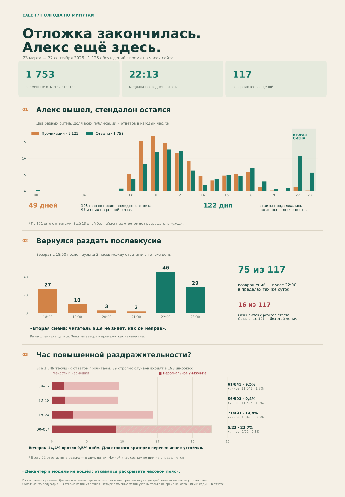

# Отложка закончилась. Алекс ещё здесь

**Все три направления выполнены.** Период: **23 марта — 22 сентября 2026**, 184 завершённых дня. Время везде такое, как показал сайт; часовой пояс не установлен.

| Направление | Результат | Полный разбор |
|---|---|---|
| Алекс вышел, стендалон остался | В 49 днях после последнего найденного ответа вышли 105 записей; 97 — на десятиминутной сетке. Но в 122 днях автор отвечал уже после последней публикации. | [Хвосты и все ссылки](TAILS.md) |
| Вернулся раздать послевкусие | 117 возвращений после паузы от трёх часов в 100 днях. 75 возвращений — в 22:00–23:59. | [Возвращения](RETURNS.md) |
| Час повышенной раздражительности? | 14,4% резких ответов вечером против 9,5% с 08:00 до 18:00. Для строгого критерия персонального унижения — 3,0% и 1,8%; эта разница менее устойчива. | [Тон и чувствительность](REACTIONS.md) |

Главный переворот исходной версии: **типичный последний найденный ответ — в 22:13**, тогда как медиана последней публикации по всем 184 дням — 17:30. Это две разные выборки дней; по 171 дню с ответами медиана последней публикации — 17:40. Время выхода материалов плохо описывает время общения автора.

Собраны **1 125 обсуждений**, из них 1 122 относятся к ленте полугодия, ещё три старые ветки найдены через архив. Из текущего HTML получены **1 749 авторских ответов**, отдельно добавлены четыре архивные временные отметки. Собственный текст всех 1 749 ответов просмотрен; **193** отнесены к широкой категории адресной резкости, **39 из этих 193** — к строгой. Это 85 дней и 99 веток, а не 193 независимых «истерики».

Расписание согласуется с поздними возвращениями и большей долей вечерней резкости. **Занятия в паузах, употребление алкоголя и психологическое состояние из этого не следуют.** Даже среди 117 возвращений только 16 начинаются с резкого ответа, а пять — с персонального унижения.

[Объявления банов и предупреждения](MODERATION.md) · [193 размеченные реплики](REGISTER.md) · [Сатирические сцены](SATIRE.md) · [Охват и метод](COVERAGE.md) · [Формат данных и воспроизведение](SCHEMA.md)

[Предыдущее исследование публикаций](../publication-times/README.md) · [Алекс разбушевался](../outbursts/README.md) · [Хроника деградации](../lifestyle/README.md)
