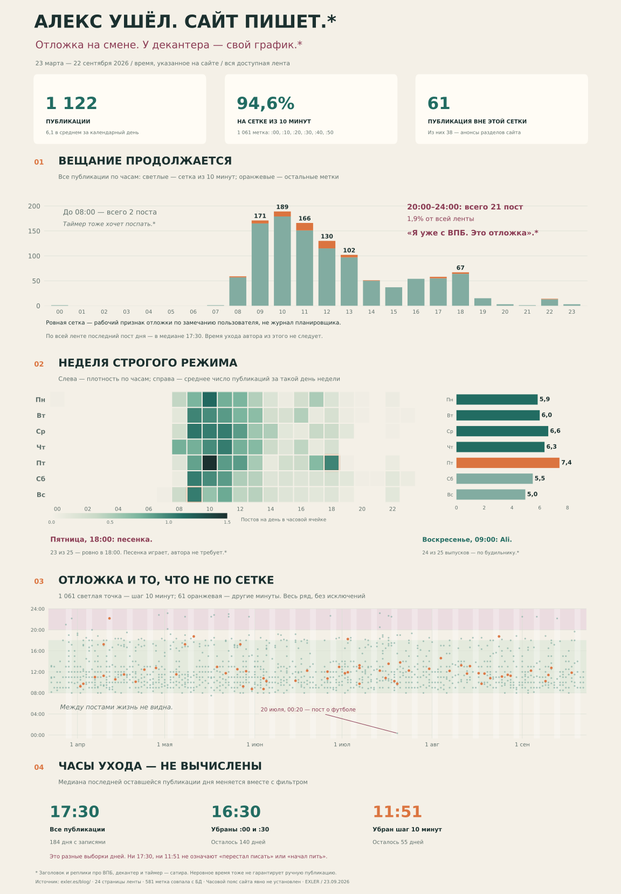

# Алекс ушёл. Сайт пишет

**1 122 публикации за 23 марта — 22 сентября 2026 года.** Собраны дата, время, название и прямая ссылка каждой доступной записи в общей ленте. Период — шесть календарных месяцев до сегодняшнего дня; незавершённое 23 сентября исключено из сравнений.

По уточнению пользователя ровные отметки рассматриваем как признак **отложенной публикации**. Поэтому график показывает расписание выхода материалов, а последний пост не используется как время ухода автора. Это рабочая модель по видимым минутам: доступа к настройкам планировщика нет; публикация между ровными слотами тоже не обязательно ручная.



[Все 1 122 записи со ссылками](PUBLICATIONS.md) · [Данные публикаций](publications.json) · [Расчёты](summary.json) · [Повторяющиеся рубрики](recurring.json) · [Метод и проверка](COVERAGE.md)

## Что получилось

### 1. По часам виден прежде всего конвейер публикаций

636 отметок стоят ровно на `:00` — **56,7%** ленты. Если добавить `:30`, получается 833 записи — **74,2%**. Широкая сетка `:00/:10/:20/:30/:40/:50` охватывает **1 061 запись, или 94,6%**.

Эти доли измеряют округлённость меток. Они согласуются с рабочей моделью отложки, но не являются долями технически подтверждённых автоматических публикаций. Час появления сообщения нельзя переносить на время его написания или занятия автора.

### 2. «Когда он ушёл» сильно зависит от того, какую сетку убрать

Для каждого дня берём время последней оставшейся публикации, затем медиану по дням, в которых осталась хотя бы одна запись.

| Какие записи исключены | Осталось публикаций | Дней с остатком | Медиана последней метки |
|---|---:|---:|---:|
| Никакие | 1 122 | 184 | 17:30 |
| Ровно `:00` | 486 | 170 | 16:40 |
| `:00` и `:30` | 289 | 140 | 16:30 |
| Любая минута, кратная 10 | 61 | 55 | 11:51 |

**11:51 — не установленное начало отдыха или выпивки.** После самого строгого фильтра 129 дней вообще остаются без данных. Кроме того, 38 из 61 оставшейся записи — анонсы других разделов: 18 «Баннизмов», 10 обзоров, шесть кинорецензий и четыре материала «Ликбеза». Обычных записей `/blog/` остаётся 23. Состав этой маленькой выборки отличается от состава всей ленты.

53 из 61 отметки вне десятиминутной сетки приходятся на время до 14:00; четыре — на 18:00 и позднее. Это характеристика оставшихся меток, а не распорядок дня человека.

### 3. Пики недели объясняются регулярными рубриками

| Рубрика | Наблюдение за период | Примеры |
|---|---|---|
| «Пятнишная песенка» | 25 выпусков по пятницам; 23 в 18:00, один в 18:15, один в 18:30 | [04.09, 18:00](https://exler.es/blog/pyatnishnaya-pesenka-476.htm), [03.07, 18:15](https://exler.es/blog/pyatnishnaya-pesenka-467.htm), [31.07, 18:30](https://exler.es/blog/pyatnishnaya-pesenka-471.htm) |
| «Баннизмы» | Все 24 выпуска — в пятницу | [Начало периода](https://exler.es/bannizm/chestnye-massazhopy-sploshnogo-gortanobesiya.htm), [конец периода](https://exler.es/bannizm/pylkie-skralbukingi-okeanskih-muh.htm) |
| Китайские находки | Все 25 выпусков — в воскресенье; 24 в 09:00, один в 09:30 | [Первый выпуск периода](https://exler.es/aliexpress/delimsya-nahodkami-iz-kitajskih-magazinov-263.htm), [последний](https://exler.es/aliexpress/delimsya-nahodkami-iz-kitajskih-magazinov-287.htm) |
| Кинорецензии | 49 анонсов: 26 в понедельник, 23 в четверг; 16 четверговых — в 08:00 | [02.04, 08:00](https://exler.es/films/majk-i-nik-i-nik-i-elis.htm), [17.09, 08:00](https://exler.es/films/gks-sent-luis.htm) |

Пятница лидирует по числу постов: **7,42 за день**, воскресенье — **4,96**. «Песенка» и «Баннизмы» дают 49 из 193 пятничных записей, то есть **25,4%**. Если убрать только эти две рубрики, пятничное среднее снижается до **5,54**, тогда как по остальным будням оно равно **6,20**. Это описательное сравнение состава ленты, а не доказательство причинной связи с настроением.

Один материал с адресом `pyatnishnaya-pesenka` на самом деле называется [«Четверговая песенка»](https://exler.es/blog/pyatnishnaya-pesenka-463.htm) и вышел 11 июня в 18:10. В 25 пятничных выпусков он не включён: URL сам по себе не определяет рубрику и день недели.

### 4. К концу лета частота снизилась, но не монотонно

| Часть периода | Календарных дней | Публикаций | В среднем за день | Медиана последнего поста дня, вся лента |
|---|---:|---:|---:|---:|
| 23–31 марта | 9 | 47 | 5,22 | 16:00 |
| Апрель | 30 | 213 | 7,10 | 18:00 |
| Май | 31 | 209 | 6,74 | 18:00 |
| Июнь | 30 | 176 | 5,87 | 17:15 |
| Июль | 31 | 197 | 6,35 | 17:30 |
| Август | 31 | 157 | 5,06 | 17:00 |
| 1–22 сентября | 22 | 123 | 5,59 | 16:55 |

В августе публикаций в расчёте на день на **28,7% меньше, чем в апреле**. В июле и сентябре есть отскок вверх. Медианный первый пост во всех семи частях периода — 09:00. Это изменение объёма и расписания ленты; непрерывную «деградацию» или сокращение личного рабочего дня эти числа не устанавливают.

### 5. Вечерняя тишина реальна, её бытовое объяснение — нет

В интервале **20:00–24:00** вышла 21 запись — **1,9%** всего ряда. Только две публикации пришлись на 00:00–07:59. Одна из них — [пост о футболе 20 июля в 00:20](https://exler.es/blog/viva-espana.htm). Округлённое время бывает и у сообщений с актуальным содержанием: это ещё одна причина не объявлять классификацию минут технической экспертизой планировщика.

Самый длинный интервал между соседними публикациями — **24 часа 30 минут**, от [анонса обзора NAS, 23 июня 09:00](https://exler.es/expromt/obzor-setevogo-nakopitelya-nas-terramaster-f4-425.htm) до [«Отгуляли на Лиго», 24 июня 09:30](https://exler.es/blog/otgulyali-na-ligo.htm). В следующем сообщении автор сам рассказывает о празднике со старой компанией. Совпадение паузы с этим рассказом содержательно, но не устанавливает занятия в каждую минуту паузы, вид напитка или состояние опьянения.

## Сатирическая версия расписания

Следующие реплики придуманы для проекта, не являются цитатами или установленными событиями:

- **«Алекс уже с ВПБ. В 18:00 за него выступит песенка».** Механизм: публикация выглядит как присутствие автора, хотя может быть отложена.
- **«Я уже ушёл декантировать. Стендалон ещё минут сорок будет иметь мнение».** Реквизит — декантер из нашего канона; продолжительность вымышлена.
- **«Воскресенье, девять утра. Будильник прозвенел китайской находкой».** Основа: 24 из 25 воскресных выпусков в 09:00.
- **«Пятничная песенка — голосовое сообщение от таймера».** Основа: 23 одинаковые отметки 18:00.
- **«Вдохновение приходит в :00. Иногда вдохновение задерживается до :10».** Основа: 94,6% меток на десятиминутной сетке.

Для этой версии графика использованы [выжимка Неолурка](../../sources/neolurk-summary.md) и [наш канон](../../canon/our-canon.md). ВПБ, декантер и вымышленный уход автора не подменяют данные.

## Файлы и воспроизведение

`collect.py` получает страницы общей ленты; `analyze.py` строит реестр и агрегаты из сохранённого `pages.json`; `render_chart.py` рисует PNG и SVG. Требуются Python, Beautiful Soup, NumPy и Matplotlib. Обновление ленты при новом запуске может изменить набор доступных публикаций.

```bash
python collect.py --pages 1 24 --workers 4
python analyze.py
python render_chart.py
```

Расчётные границы дат явно заданы в `analyze.py`. Для воспроизведения сохранённого результата достаточно последних двух команд. На графике указаны часы сайта без пересчёта в какой-либо часовой пояс.
